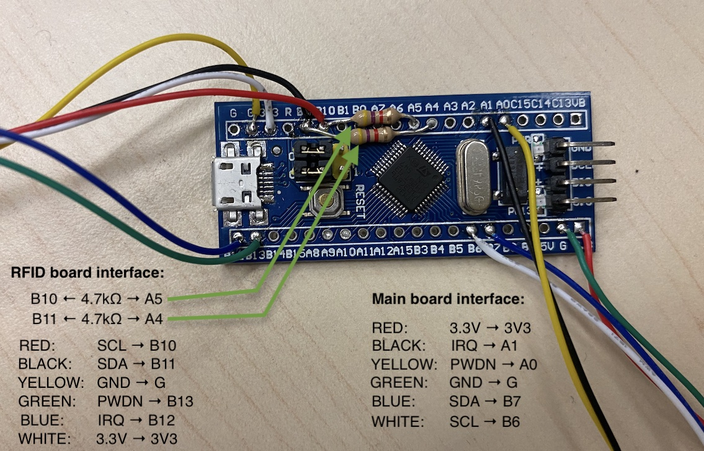
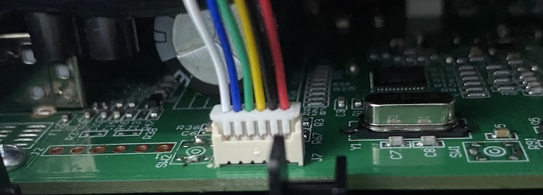
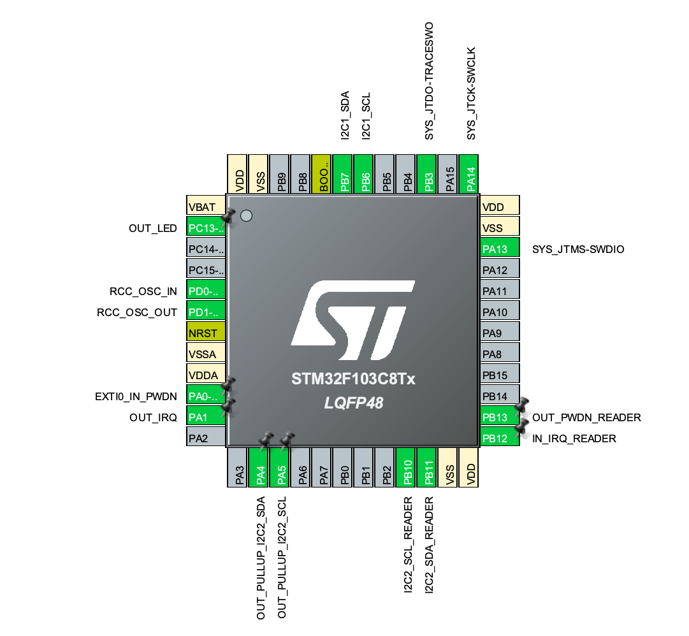

## FreeDMO

Endless freedom for D.MO 550 series label writer printer.

[](https://github.com/queengooborg/free-dmo-stm32/releases/latest) <== Click here to download

**Please consider dumping RFID tag data and providing it here for others** (see: https://github.com/free-dmo/free-dmo-tag-dump).

## Setup

This mod requires basic knowledge of microprocessors, electronics and soldering. Do not proceed if you do not know what you're doing. This project and its authors/contributors are not liable for any damage or injury; perform this mod at your own risk.

### Required tools

- 1× Philips 00 screwdriver

- 1× ST-LINK V2 or UART Adapter<br>
  Required to program the bluepill, as it cannot be programmed from the Micro USB port.

### Required parts

- 1× D.MO 550 series label printer<br />
  Tested on 550, 550 Turbo and 5XL.

- 1× STM32F103C8T6 bluepill<br/>
  search for: `STM32F103 bluepill` / `STM32F103 bluepill with STLinkV2`<br/>
  Make sure your bluepill is a STM32F103C**8**T6, not a STM32F103C**6**T6.
  **ATTENTION:** Many vendors sell [counterfeit bluepills](https://github.com/keirf/greaseweazle/wiki/STM32-Fakes). Counterfeits may not function properly or at all.

- 1× 6-pin Molex PicoBlade cable<br/>
  search for: `6 pin Molex PicoBlade 1.25 mm` / `6pin 1.25mm MX Wire To Board Connector` / `JST MX 6pin`<br />
  You will need to cut this cable in half, with a connector on each side and loose ends on the other. If your cable is short, you may want to get two cables instead.

- 2× `4.7kΩ` resistor<br />
  Optional, not required if you do not care about reading real RFID tags.

### Assembly

**→ Make sure that the cables are connected correctly.**<br/>
In the photos below, the left cables go to the RFID board, the right cables go to the main board of the label printer.

_Attaching the RFID board is optional._ If you only want to emulate one specific label type and you do not care about reading real tags, you don't have to connect the RFID board and 2 x 4k7Ω resistors.

STM32F103 blue pill:


Connection to RFID board:


Connection to main board:


**Double check your wiring before connecting the D.MO to power.**

### Obtain the firmware

There are two ways to obtain the firmware you will be flashing onto your bluepill:

#### Use the precompiled firmware

Precompiled firmware binaries are available here: [Download](https://github.com/queengooborg/free-dmo-stm32/releases/latest)

You can choose one of the firmwares which has a default SKU for emulation (used when no real RFID tag is present).

#### Compile from source

To compile the firmware from source, perform the following steps:

1. Install the required ARM toolchain
   - Debian Linux:
     - `sudo apt install gcc-arm-none-eabi libnewlib-arm-none-eabi`
   - Windows/macOS/Other Linux:
     - https://developer.arm.com/downloads/-/gnu-rm
     - Open the Makefile and modify the first line `GCC_PATH` to point to the GNU ARM embedded toolchain `bin` folder (e.g. `GCC_PATH = ../gcc-arm-none-eabi-10.3-2021.07/bin`)
2. Run `make` to compile the firmware

A `freedmo.bin` file will be created in the `build` folder.

### Install the firmware

1. Install the [`STM32CubeProgrammer`](https://www.st.com/en/development-tools/stm32cubeprog.html) application (if you haven't already)
2. Switch your bluepill to DFU mode by [switching the BOOT0 jumper to 1](ASSEMBLY_PICTURES/dfu.jpg)
   - While it is not required for ST-LINK programming, it is good practice to make sure your bluepill will not attempt to run firmware during programming
3. Connect your bluepill using a programming module. This may be either:
   - An ST-LINK V2 (SWD download)
     1. Connect all pins to their corresponding counterparts (3.3V to 3.3V, etc.) between the bluepill and ST-LINK
        - Note: "SWIO" and "SWDIO" are the same pin
     2. Connect the ST-LINK to your computer
        - If you haven't yet, it is highly recommended to update the ST-LINK's firmware to reduce potential issues
   - A UART adapter (serial download)
     1. From the UART adapter to the bluepill, [connect VCC to 5V, GND to GND, TX0 to A10, and RX1 to A9](https://www.electronicshub.org/wp-content/uploads/2020/02/Connections-for-Programming-STM32.jpg)
     2. Connect the UART adapter to your computer
4. Launch `STM32CubeProgrammer`
5. In the top-right corner, select the appropriate connection method (`ST-LINK` or `UART`)
   - If the ST-LINK is detected, its [serial number will appear in the appropriate field](ASSEMBLY_PICTURES/st-link-programming.png)
   - If you are using a UART adapter, you will need to [select the appropriate port](https://www.electronicshub.org/wp-content/uploads/2020/02/STM32CubeProgrammer-Config-1.jpg)
6. Click the `Connect` button in the top-right corner
7. Select the [`Erasing & Programming` tab](https://www.electronicshub.org/wp-content/uploads/2020/02/STM32CubeProgrammer-Config-2.jpg) on the left side
8. In the `File path` field, click `Browse` and select the desired firmware
   - Tip: make sure that the `Start address` is `0x08000000`
9. Click `Start Programming`
10. Once programming is complete, click `Disconnect` in the top-right corner and disconnect your programming module from both your computer and the bluepill
11. Switch your bluepill back to normal mode by [switching the BOOT0 jumper back to 0](ASSEMBLY_PICTURES/dfu.jpg)

Happy printing... 😈

## Usage

The bluepill will emulate the RFID tag of a D.MO label roll if an RFID tag is not already detected, including counting down the remaining labels. To reset the remaining label count, simply power cycle the printer.

## Troubleshooting

### I can't program the board with the Micro USB port, what do I do?

Unfortunately, you cannot program the bluepill with its Micro USB port. You will have to use an ST-LINK v2 or a UART adapter.

### I've assembled my printer but it won't print because "unknown labels are loaded".

Double-check your connections between the bluepill and the mainboard. You may have a loose connection which is preventing the bluepill and mainboard from connecting to each other. If it is still not working, check for solder bridges between the pins.

### I can't read real RFID tags, I can only emulate them.

Double-check your connections between the bluepill and the RFID board. Also, make sure your two resistors are installed properly and their pins aren't touching.

Note: you should also double-check if you have an [authentic STM32F103 bluepill](https://github.com/keirf/greaseweazle/wiki/STM32-Fakes).

## Technical info

### D.MO RFID tag emulation

After startup of the printer a default tag emulation is used which can be defined in the firmware.
The emulation will count down correctly until the end of the roll is reached. A power cycle / sleep+wakeup of the printer is enough to reset the emulated tag counter back to it's maximum.

If the original RFID board is also connected and a spool with D.MO RFID tag is found then the emulation data is updated with the data from this RFID tag. Just the counter will be emulated in this case. The tag that is detected and emulated upon powerup is the only label that will be recognized in the printer until another power cycle. This enables the use of any D.MO format unless you have at least one original spool (you can peel the RFID label of that role and attach it to the inside of the printer). If you change genuine labels (with RFID tag) then you will need to power cycle the printer to detect the new label.

**Please consider dumping this data and providing it here for others** (see: https://github.com/free-dmo/free-dmo-tag-dump).

D.MO uses it's own Originality Signature (own signing key) which is used to sign the UID of the tag.
This is used to only allow D.MO's own SLIX2 tags. However when you can emulate the UID you also can emulate the corresponding signature bytes, you just need to dump them from a valid tag.<br/>(see: https://github.com/free-dmo/free-dmo-tag-dump).

The firmware contains some D.MO SLIX2 tag dumps which you can choose from: <br/>
file: `Src/main.c`

```C
#define SLIX2_TAG_EMU 1
//#define SLIX2_TAG_EMU 2
//#define SLIX2_TAG_EMU 3
```

It does not matter which TAG_EMU you use. All of them will work for now. Maybe... in future D.MO will release new printer / firmware which might block those UIDs... but then we only need to dump a new spool of labels to get a new and valid UID+signature.

The data about the labels (SKU, size, count, ...) is encoded in the standard SLIX2 data blocks.
**Inside of this data is no dependency to the UID or signature**. This enables a "mix and match" of SLIX2 tag (UID+signature) and the media data used from the printer. Unfortunately the encoded data uses an unknown CRC32 algorithm which limits us to use existing dumped label formats only.

You can choose from the list of included label data by selecting the SKU: <br/>
file: `Src/main.c`

```C
#define DMO_SKU_S0722430 // 54 x 101 mm, 220 pcs.
//#define DMO_SKU_S0722550 // 19 x  51 mm, 500 pcs.
//#define DMO_SKU_S0722400 // 36 x  89 mm, 50 pcs.
```

### STM32CubeMx

The project comes with the CubeMX .ioc file which can be used to modify pins and/or change to different CPU types. The complete code is inside of ST's magic `BEGIN_USER_CODE` / `END_USER_CODE` markers so "Generate Code" in CubeMX can be used without any problems.

#### STM32F103 pin assignment


