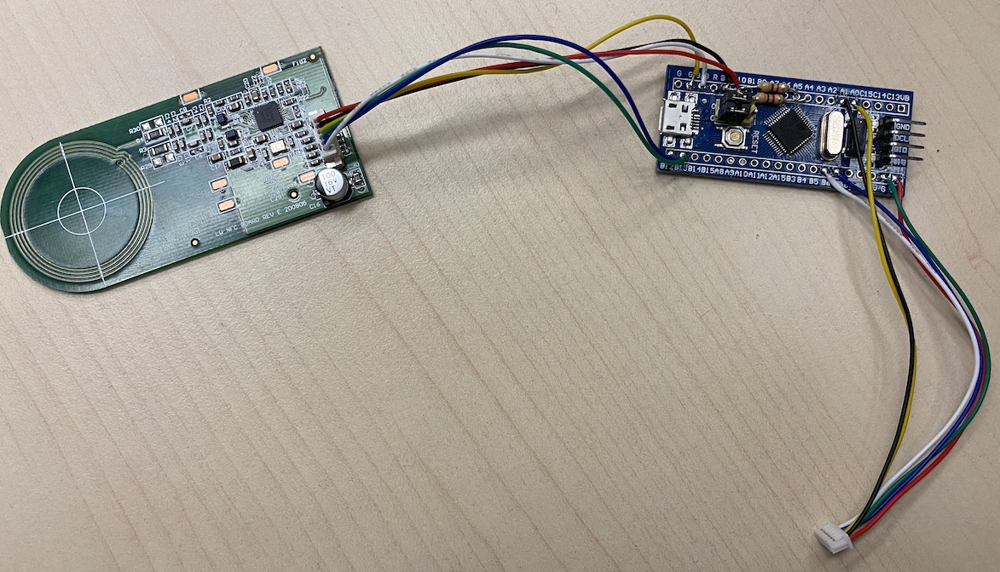

##FreeDMO

Endless freedom for D.MO 550 series label writer printer.

##Wiring

Components needed:

 * 1x STM32F103 bluepill 
   search for: `STM32F103 bluepill` / `STM32F103 bluepill with STLinkV2`
 
 * 2x cable 
   search for: `6 pin 1.25 mm` / `6pin 1.25mm Wire To Board Connector` / `JST ZH 6pin`
 
 * 2x resistor `4.7kΩ`
 
 
##Assembly

**→ Make sure that the cables are connected correctly.** 
The left cable goes to the RFID board, the right cable goes to the main board of the label printer.

*Attaching the RFID board is optional.* If you only want to emulate one specific label type you don't have to connect the RFID board and 2 x 4k7Ω resistors.

STM32F103 blue pill:

Connection to RFID board:

Connection to main board:

##Firmware

Option 1: Install required ARM toolchain from distribution

 * install ARM toolchain from distribution (e.g. on Debian-based GNU/Linux install the gcc-arm-none-eabi and libnewlib-arm-none-eabi packages)

 * run `make` to compile the firmware

Option 2: Install required ARM toolchain GNU Arm Embedded Toolchain from ARM: 

 * download and unpack from here: https://developer.arm.com/tools-and-software/open-source-software/developer-tools/gnu-toolchain/gnu-rm/downloads

 * open Makefile and modify first line `GCC_PATH` to point to the GNU ARM embedded Toolchain `bin` folder 
   e.g. `GCC_PATH = ../gcc-arm-none-eabi-10.3-2021.07`

 * run `make` to compile the firmware

Option 3: Use the precompiled firmware 

 * a precompiled firmware binary is avalibale in the `COMPILED_FIRMWARE` folder

##Download firmware to STM32F103 bluepill

 * after compilation you can find the firmware file `freedmo.bin` in the `build` folder

 * you can write the firmware via 

   - SWD download using JLink-V2 and ST's `JLink-Utility`

   or

   - Serial download using an UART adapter and ST's `FlashLoader Demonstrator` 
     This is the same procedure as downloading a USB bootloader to the bluepill board: 
     https://www.electronicshub.org/how-to-upload-stm32f103c8t6-usb-bootloader 
     Just select the file `freedmo.bin` in "Download from file" (2)

##STM32CubeMx

The project comes with the CubeMX .ioc file which can be used to modify pins and/or change to different CPU types. The complete code is inside of ST's magic `BEGIN_USER_CODE` / `END_USER_CODE` markers so "Generate Code" in CubeMX can be used without any problems.

###STM32F103 pin assignment

##D.MO RFID tag emulation

After startup of the printer a default tag emulation is used which can be defined in the firmware.
The emulation will count down correctly until the end of the roll is reached. A power cycle / sleep+wakeup of the printer is enough to reset the emulated tag counter back to it's maximum.

If the original RFID board is also connected and a spool with D.MO RFID tag is found then the emulation data is updated with the data from this RFID tag. Just the counter will be emulated in this case. This enables the use of any D.MO format unless you have at least one original spool (you can peel the RFID label of that role and attach it to the inside of the printer).

**Please consider dumping this data and providing it here for others** (see: https://github.com/free-dmo/free-dmo-tag-dump).

D.MO uses it's own Originality Signature (own signing key) which is used to sign the UID of the tag.
This is used to only allow D.MO's own SLIX2 tags. However when you can emulate the UID you also can emulate the coressponding signature bytes, you just need to dump them from a valid tag. (see: https://github.com/free-dmo/free-dmo-tag-dump).

The firmware contains some D.MO SLIX2 tag dumps which you can choose from:  
file: `Src/main.c`

`#define SLIX2_TAG_EMU 1`  
`//#define SLIX2_TAG_EMU 2`  
`//#define SLIX2_TAG_EMU 3`  

It does not matter which TAG_EMU you use. All of them will work for now. Maybe... in future D.MO will release new printer / firmware which might block those UIDs... but then we only need to dump a new spool of labels to get a new and valid UID+signature.

The data about the labels (SKU, size, count, ...) is encoded in the standard SLIX2 data blocks. 
**Inside of this data is no dependency to the UID or signature**. This enables a "mix and match" of SLIX2 tag (UID+signature) and the media data used from the printer. Unfortunately the encoded data uses an unknown CRC32 algorithm which limits us to use exisiting dumped label formats only.

You can choose from the list of included label data by selecting the SKU:  
file: `Src/main.c`

`#define DMO_SKU  S0722430 // 54 x 101 mm, 220 pcs.` 
`//#define DMO_SKU  S0722550 // 19 x  51 mm, 500 pcs.`  
`//#define DMO_SKU  S0722400 // 36 x  89 mm, 50 pcs.`  

Happy printing... 😈
